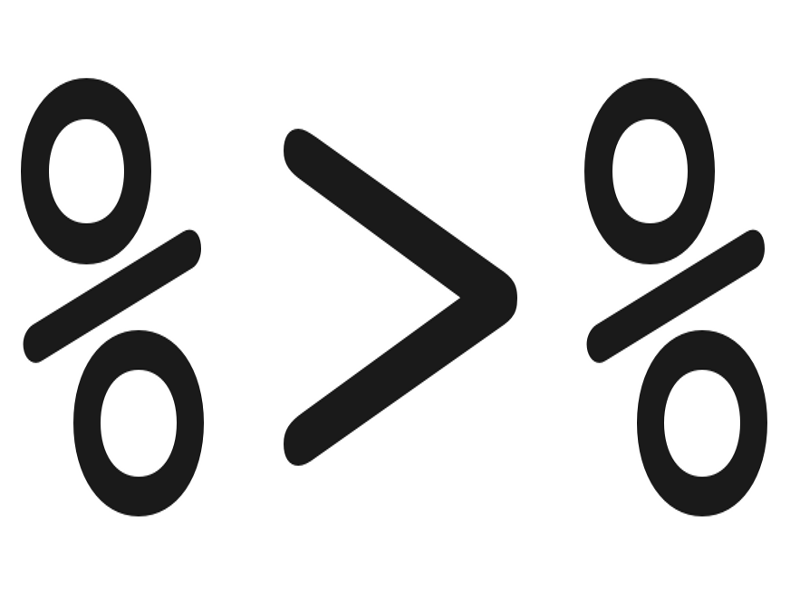

## Philosophy

ggvis is a new (Apr 2013) visualization library for R. It is developed by Rstudio's Winston Chang and Hadley Wickham <a href = "http://ggvis.rstudio.com/" target="_blank">http://ggvis.rstudio.com/</a>

integrates:
  
>- Data pipeline (dplyr)
>- A grammar of graphics (ggplot2)
>- Interactivity (Shiny)
>- Web oriented (vega.js)

## Data pipeline



## Data pipeline
The %>% operator allows to chain functions in a readable way
```{r, message=FALSE, warning=FALSE, eval=FALSE}
library(dplyr)
library(hflights)
hflights %>%
   group_by(Year, Month, DayofMonth) %.%
   select(Year:DayofMonth, ArrDelay, DepDelay) %.%
   summarise(
     arr = mean(ArrDelay, na.rm = TRUE), 
     dep = mean(DepDelay, na.rm = TRUE)
   ) %>%
   filter(arr > 30 | dep > 30)
```

## Data pipeline
```{r, message=FALSE, warning=FALSE, echo=FALSE}
library(dplyr)
library(hflights)
hflights %>%
   group_by(Year, Month, DayofMonth) %.%
   select(Year:DayofMonth, ArrDelay, DepDelay) %.%
   summarise(
     arr = mean(ArrDelay, na.rm = TRUE), 
     dep = mean(DepDelay, na.rm = TRUE)
   ) %>%
   filter(arr > 30 | dep > 30)
```

## Grammar of graphics

In a similar way to ggplot2, we first define the data set:

```{r, message=FALSE, warning=FALSE, eval=TRUE, results='hide'}
library(ggplot2)
library(dplyr)
library(ggvis)
set.seed(1234)
dsmall <- diamonds[sample(nrow(diamonds), 100), ]
dsmall %>% ggvis(~carat, ~price)
```

... and we add a layer
```{r, message=FALSE, warning=FALSE, eval=TRUE, results='hide'}
dsmall %>% ggvis(~carat, ~price) %>% layer_points()
```
(ggvis can read your mind, but ggplot2 can''t)

## 

```{r, message=FALSE, warning=FALSE, echo=FALSE}
library(ggplot2)
library(dplyr)
library(ggvis)
dsmall <- diamonds[sample(nrow(diamonds), 100), ]
dsmall %>% ggvis(~carat, ~price) %>% layer_points()
```


## Notation
- We use `~` before a variable from the dataset.
- We use `:=` to use a raw, unscaled value.

## Layers

- layer_points 
- layer_paths (Draw a line in the order of the data)
- layer_lines (Draw a line after sorting x)
- layer_areas 
- layer_text
- layer_ribbons
- layer_densities
- layer_histogram

## 
```{r, warning=FALSE, message=FALSE}
mtcars2 <- dplyr::mutate(mtcars, cyl = factor(cyl))
mtcars2 %>% ggvis(~wt, ~mpg, stroke = ~cyl) %>% layer_lines()
```

## 
```{r, warning=FALSE, message=FALSE}
mtcars2 %>% ggvis(~wt, ~mpg, stroke := "red") %>% layer_paths()
```

## 
```{r, warning=FALSE, message=FALSE}
df <- data.frame(x = c(1, 1, 1.5, 2, 2), y = c(2, 1, 1.5, 1, 2))
df %>% ggvis(~x, ~y, stroke := "red") %>% layer_paths()
```

## 
Add a fill colour to make it a polygon
```{r, warning=FALSE, message=FALSE}
df %>% ggvis(~x, ~y, fill := "red") %>% layer_paths()
```

## 
Add a fill colour to make it a polygon
```{r, warning=FALSE, message=FALSE, eval=FALSE}
hec <- as.data.frame(xtabs(Freq ~ Hair + Eye, HairEyeColor))
hec %>% 
  ggvis(~Hair, ~Eye, fill = ~Freq) %>% 
  layer_rects(width = band(), height = band()) %>%
  scale_nominal("x", padding = 0, points = FALSE) %>%
  scale_nominal("y", padding = 0, points = FALSE)
```

## 
```{r, warning=FALSE, message=FALSE, echo=FALSE, fig.width=6}
hec <- as.data.frame(xtabs(Freq ~ Hair + Eye, HairEyeColor))
hec %>% 
  ggvis(~Hair, ~Eye, fill = ~Freq) %>% 
  layer_rects(width = band(), height = band()) %>%
  scale_nominal("x", padding = 0, points = FALSE) %>%
  scale_nominal("y", padding = 0, points = FALSE)
```

## Combining layers
```{r, warning=FALSE, message=FALSE, fig.height=3.5}
dsmall %>% ggvis(~carat, ~price) %>% 
  layer_points() %>% layer_smooths()
```

## 
```{r, warning=FALSE, message=FALSE}
dsmall %>% ggvis(~carat, ~price) %>% layer_points() %>%
layer_model_predictions(model = "lm", se = TRUE)
```

## Properties
```{r, warning=FALSE, message=FALSE, fig.height=3.5}
dsmall %>% ggvis(~carat, ~price) %>% 
layer_points(size := 25, shape := "diamond", 
             stroke := "red", fill := NA)
```

## 
```{r, warning=FALSE, message=FALSE, fig.width=7}
dsmall %>%
  ggvis(x=~carat, y=~price) %>%
  layer_points(fill = ~factor(cut))
```

## 
```{r, warning=FALSE, message=FALSE, eval=FALSE, fig.width=7}
dsmall %>%
  mutate(z=factor(carat<1.1)) %>%
  ggvis(~carat, ~price, fill = ~factor(z)) %>% 
  layer_points() %>% 
  group_by(z) %>% 
  layer_model_predictions(model = "lm",  stroke = ~z)
```

## 
```{r, warning=FALSE, message=FALSE, fig.width=7, echo=FALSE}
dsmall %>%
  mutate(z=factor(carat<1.1)) %>%
  ggvis(~carat, ~price, fill = ~factor(z)) %>% 
  layer_points() %>% 
  group_by(z) %>% 
  layer_model_predictions(model = "lm",  stroke = ~z)
```

## 
```{r, warning=FALSE, message=FALSE, fig.width=6.5}
dsmall %>%
  ggvis(~carat, ~price, shape = ~factor(cut, ordered=F)) %>%
  layer_points()
```

## Axis properties
```{r, warning=FALSE, message=FALSE, eval=FALSE, fig.width=6.5}
dsmall %>%
  ggvis(~carat, ~price, shape = ~factor(cut, ordered=F)) %>%
  layer_points() %>%
  add_axis("x", title = "Weight of the diamond", 
           title_offset = 1, 
           properties = axis_props(
             axis = list(stroke = "green", strokeWidth = 5),
             grid = list(stroke = "red"),
             ticks = list(stroke = "blue", strokeWidth = 5),
             labels = list(angle = 45, align = "left", fontSize = 20)
  )) %>%
  add_axis("y", title = "Price in US dollars")
```

## Axis properties
```{r, warning=FALSE, message=FALSE, echo=FALSE, fig.width=6.5}
dsmall %>%
  ggvis(~carat, ~price, shape = ~factor(cut, ordered=F)) %>%
  layer_points() %>%
  add_axis("x", title = "Weight of the diamond", 
           title_offset = 100, 
           properties = axis_props(
             axis = list(stroke = "green", strokeWidth = 5),
             grid = list(stroke = "red"),
             ticks = list(stroke = "blue", strokeWidth = 5),
             labels = list(angle = 45, align = "left", fontSize = 20)
  )) %>%
  add_axis("y", title = "Price in US dollars") %>%
  add_legend(title = "my title", scales="shape")
```

## Activity
Replicate in ggvis this plot created in ggplot2:
```{r, warning=FALSE, message=FALSE, eval=FALSE}
library(ggplot2)
library(gcookbook) # For the data set
data= subset(countries, Year==2009 & healthexp>2000)
sp <- ggplot(data, aes(x=healthexp, y=infmortality))
sp <- sp + geom_point()
sp <- sp + geom_text(aes(y=infmortality+.1, label=Name),
                     size=3, vjust=0)
print(sp)
```

## 
```{r, warning=FALSE, message=FALSE, echo=FALSE}
library(ggplot2)
library(gcookbook) # For the data set
data= subset(countries, Year==2009 & healthexp>2000)
sp <- ggplot(data, aes(x=healthexp, y=infmortality))
sp <- sp + geom_point()
sp <- sp + geom_text(aes(y=infmortality+.1, label=Name),
                     size=3, vjust=0)
print(sp)

```

## Interactive graphics with ggvis
One of the advantages of using ggvis is interactivity. There are two main sources of interactivity:

>- Hovering/clicks. The plot reacts to hovering or clicks from the users
>- Shiny. The plots incorporate elements from shiny library such as sliders or selection boxes.

## Hovering
```{r, warning=FALSE, message=FALSE, fig.height=4}
mtcars %>% ggvis(x = ~wt, y = ~mpg, size.hover := 200) %>%
  layer_points()
```

## 
```{r, warning=FALSE, message=FALSE, fig.height=4}
mtcars %>%
  ggvis(x = ~wt, y = ~mpg, size.hover := 200,
        stroke := NA, stroke.hover := "red", strokeWidth := 3) %>%
  layer_points()
```

## 
```{r, warning=FALSE, message=FALSE, fig.height=4}
pressure %>% ggvis(x = ~temperature, y = ~pressure) %>%
  layer_paths(stroke.hover := "red", strokeWidth.hover := 4, strokeWidth := 2) %>%
  layer_points(size := 50, size.hover := 200) %>%
  set_options(hover_duration = 250)
```

## 
```{r, warning=FALSE, message=FALSE, fig.height=4}
mtcars %>% ggvis(x = ~wt, y = ~mpg) %>%
  layer_points() %>%
  layer_smooths(fill.hover := "red", se = TRUE)
```

## 
```{r, warning=FALSE, message=FALSE, eval=FALSE}
all_values <- function(x) {
  if(is.null(x)) return(NULL)
  paste0(names(x), ": ", format(x), collapse = "<br />")
}
base <- mtcars %>% ggvis(x = ~wt, y = ~mpg) %>%
  layer_points()
base %>% add_tooltip(all_values, "hover")
```

## 
```{r, warning=FALSE, message=FALSE, echo=FALSE}
all_values <- function(x) {
  if(is.null(x)) return(NULL)
  paste0(names(x), ": ", format(x), collapse = "<br />")
}
base <- mtcars %>% ggvis(x = ~wt, y = ~mpg) %>%
  layer_points()
base %>% add_tooltip(all_values, "hover")
```

## 
```{r, warning=FALSE, message=FALSE}
base %>% add_tooltip(all_values, "click")
```

## Shiny interactivity
```{r, warning=FALSE, message=FALSE, eval=FALSE}
library(shiny)
library(dplyr)
library(ggvis)

mtcars %>% ggvis(x = ~wt) %>%
  layer_densities(
    adjust = input_slider(.1, 2, value = 1, step = .1, label = "Bandwidth adjustment"),
    kernel = input_select(
      c("Gaussian" = "gaussian",
        "Epanechnikov" = "epanechnikov",
        "Rectangular" = "rectangular",
        "Triangular" = "triangular",
        "Biweight" = "biweight",
        "Cosine" = "cosine",
        "Optcosine" = "optcosine"),
      label = "Kernel")
  )
```

## 
```{r, warning=FALSE, message=FALSE, echo=FALSE}
library(shiny)
library(dplyr)
library(ggvis)

mtcars %>% ggvis(x = ~wt) %>%
  layer_densities(
    adjust = input_slider(.1, 2, value = 1, step = .1, label = "Bandwidth adjustment"),
    kernel = input_select(
      c("Gaussian" = "gaussian",
        "Epanechnikov" = "epanechnikov",
        "Rectangular" = "rectangular",
        "Triangular" = "triangular",
        "Biweight" = "biweight",
        "Cosine" = "cosine",
        "Optcosine" = "optcosine"),
      label = "Kernel")
  )
```

## 
```{r, warning=FALSE, message=FALSE, eval=FALSE}
slider <- input_slider(10, 1000)
mtcars %>% ggvis(~wt, ~mpg) %>%
  layer_points(fill := "red", size := slider) %>%
  layer_points(stroke := "black", fill := NA, size := slider)
```

## 
```{r, warning=FALSE, message=FALSE, echo=FALSE}
slider <- input_slider(10, 1000)
mtcars %>% ggvis(~wt, ~mpg) %>%
  layer_points(fill := "red", size := slider) %>%
  layer_points(stroke := "black", fill := NA, size := slider)
```

## The good, the bad, and the ugly about ggvis
>- *The good*: Is next generation of ggplot2, is intended to replace it in the middle term. It takes visualization to a new stage
>- *The bad*: Still needs to incorporate key components as faceting or even main titles!
>- *The ugly*: Unstable, the grammar is constantly changing, and there are some software dependencies hard to reach.
