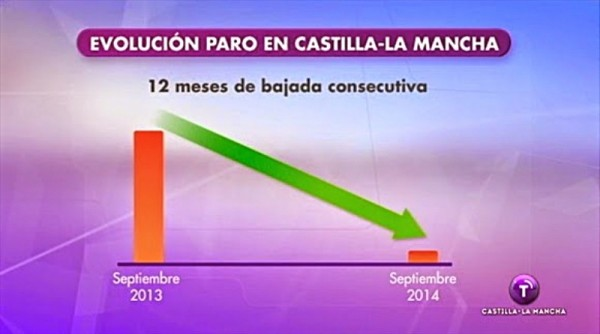
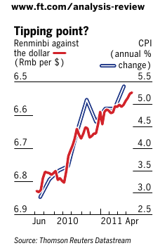

## 

<myintro> Why R to plot?</myintro>

## Three Reasons:
  
 >- *Practical*: R is the "de facto" programming language for data analysis. Plot your data where your data lives.
(Have you ever tried to make a simple scatterplot with labels in Excel? I hope not...)
 >- *Flexibility*: R has a wide broad of graphical tools and constantly evolving
 >- *Aesthetics*: R graphics are beautiful, although this is subjective!

## Do's and don'ts
  
Sense of aesthetics is hard to get. But it can be developed by reading books such as:

 - <a href = "http://www.edwardtufte.com/tufte/books_vdqi" target="_blank">The visual display of quantitative information</a>
 - <a href = "http://www.amazon.es/Visualize-This-Nathan-Yau/dp/3527760229/" target="_blank">Visualize This!</a>
 - <a href = "http://www.amazon.es/Data-Points-Visualization-Means-Something/dp/111846219X" target="_blank">Data Points: Visualization That Means Something </a>

##

<cat1>DON'T...</cat1>

## ... use 3D pie charts
<iframe src = 'http://files.chandoo.org/video/why-3d-pie-charts-can-be-evil/why-3d-pie-charts-can-be-evil_player.html' height='600px'></iframe>

## ... use pie charts at all
<iframe src = 'https://blogs.oracle.com/experience/entry/countdown_of_top_10_reasons_to_never_ever_use_a_pie_chart' height='600px'></iframe>

## ... manipulate the scales

(**Real decrease: 250630 -> 235049**)

## ... use two vertical axis

(You can create a spurious correlation between any mononote series)

## More (bad) examples

<iframe src = 'http://data.heapanalytics.com/how-to-lie-with-data-visualization/' height='600px'></iframe>

## The R graphics ecosystem

  - Basic plots <a href = "http://www.statmethods.net/graphs/" target="_blank">http://www.statmethods.net/graphs/</a>
  - ggplot2 <a href = "http://ggplot2.org/" target="_blank">http://ggplot2.org/</a>
  - lattice <a href = "http://lattice.r-forge.r-project.org/" target="_blank">http://lattice.r-forge.r-project.org/</a>
  - ggvis <a href = "http://ggvis.rstudio.com/" target="_blank">http://ggvis.rstudio.com/</a>
  - bigvis <a href = "https://github.com/hadley/bigvis" target="_blank">https://github.com/hadley/bigvis</a>
  - rCharts <a href = "http://rcharts.io/" target="_blank">http://rcharts.io/</a>
  - plotly <a href = "https://plot.ly/r/" target="_blank">https://plot.ly/r/</a>
  - googleVis: <a href = "https://github.com/mages/googleVis" target="_blank">https://github.com/mages/googleVis</a>
  - and others: circleplots, ggmaps, lively, etc...
